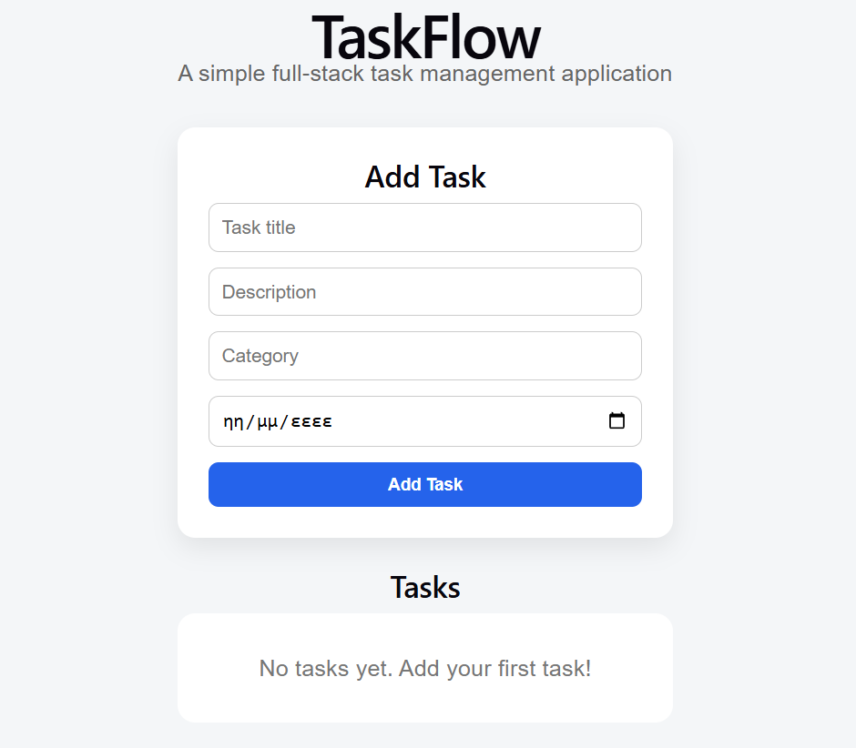
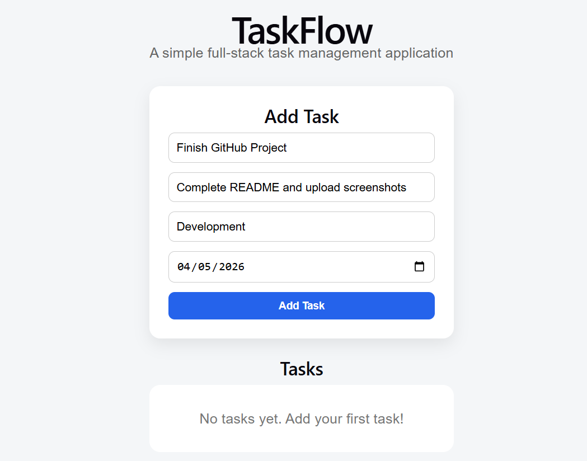
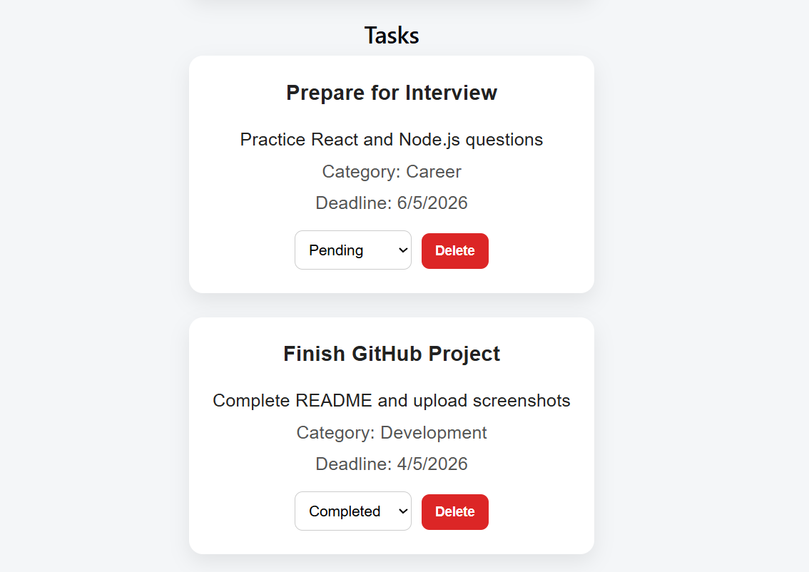

# TaskFlow - MERN Task Manager

A full-stack task management application built with the MERN stack (MongoDB, Express, React, Node.js).

---

## Screenshots

### Main UI


### Add Task


### Task List


---

## Tech Stack

- **Frontend:** React (Vite), Axios
- **Backend:** Node.js, Express
- **Database:** MongoDB
- **Containerization:** Docker

---

## Features

- Add new tasks
- Delete tasks
- Update task status (Pending / In Progress / Completed)
- REST API
- MongoDB data persistence
- Clean UI

---

## How to Run Locally

### 1. Clone repository
```bash
git clone https://github.com/YOUR-USERNAME/taskflow-mern-docker.git
cd taskflow-mern-docker
```

### 2. Start Backend (Terminal 1)
```bash
cd backend
npm install
npm run dev
```

### 3. Start Frontend (Terminal 2)
```bash
cd frontend
npm install
npm run dev
```

### 4. Open in browser
```bash
http://localhost:5173
```

## Docker (optional)
```bash
docker compose up -d
```

## Future Improvements
- User authentication (login/register)
- Task filtering
- Responsive design improvements
- Deployment (Render / Vercel)

---
## Author
Eirini Markantoni
